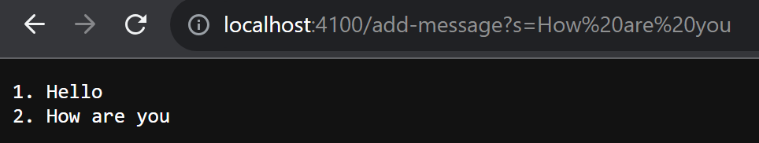
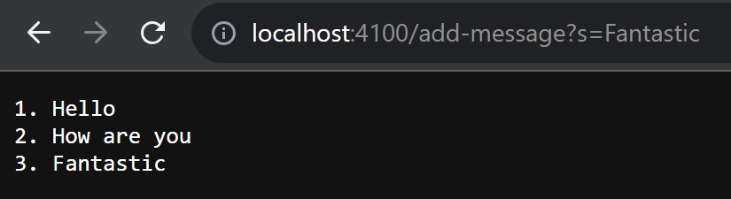
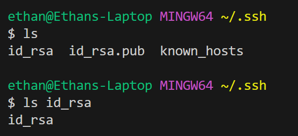
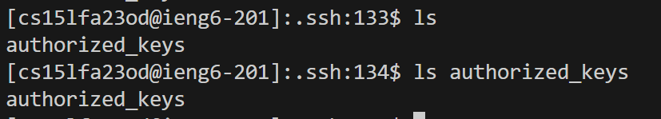
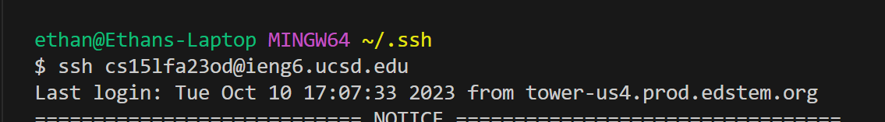

### Part 1

```java
import java.io.IOException;
import java.net.URI;
import java.util.ArrayList;

class StringServerHandler implements URLHandler {
    ArrayList<String> strings = new ArrayList<String>();

    public String handleRequest(URI url) {
        if (url.getPath().contains("/add-message")) {
            String[] parameters = url.getQuery().split("=");
            if (parameters[0].equals("s")) {
                strings.add(parameters[1]);
            }  
        }
        String result = "";
        for(int i = 0; i < strings.size(); i++) {
            result += ((i+1) + ". " + strings.get(i) + "\n");
        }
        return result;
    }
} 

class StringServer {
    public static void main(String[] args) throws IOException {
        if(args.length == 0){
            System.out.println("Missing port number! Try any number between 1024 to 49151");
            return;
        }
        
        int port = Integer.parseInt(args[0]);
        Server.start(port, new StringServerHandler());
    }
}
```

Screenshot 1:

- Which methods in your code are called?
	- The `handleRequest` method is called.
- What are the relevant arguments to those methods, and the values of any relevant fields of the class?
	- The only argument is the url which is of the `URI` type. The only field of the class is the `ArrayList<String> strings` which contains the added messages. In this example, by the time it returns, it stores two strings `"Hello"` and `"How are you"`. 
- How do the values of any relevant fields of the class change from this specific request? If no values got changed, explain why.
	- The `handleRequest` method parses the url for `/add-message` and adds the query to the ArrayList. In this example, the string `"How are you"` was added to the `ArrayList<String> strings`.

Screenshot 2:

- Which methods in your code are called?
	- The `handleRequest` method is called.
- What are the relevant arguments to those methods, and the values of any relevant fields of the class?
	- The only argument is the url which is of the `URI` type. The only field of the class is the `ArrayList<String> strings` which contains the added messages. In this example, by the time it returns, it stores three strings `"Hello"`, `"How are you"`, and `"Fantastic"`. 
- How do the values of any relevant fields of the class change from this specific request? If no values got changed, explain why.
	- The `handleRequest` method parses the url for `/add-message` and adds the query to the ArrayList. In this example, the string `"Fantasitc"` was added to the `ArrayList<String> strings`.

### Part 2





### Part 3

I learned a lot about ssh keys and authentication. I knew that most systems use some sort of key for authentication but I didn't realized there was both a private and a public key. It was also interesting to see that they were generated on the client computer and then the public key was copied over to the server.