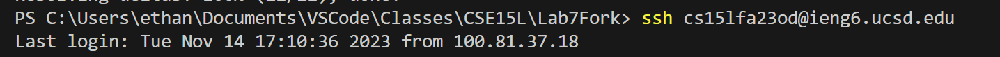
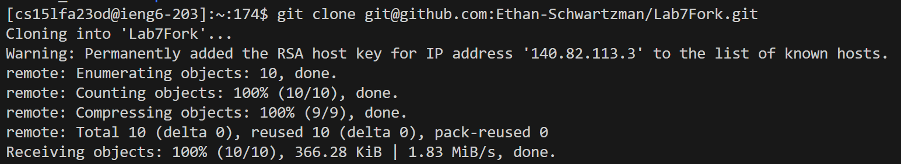
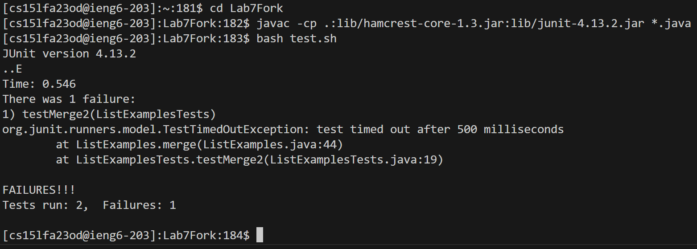
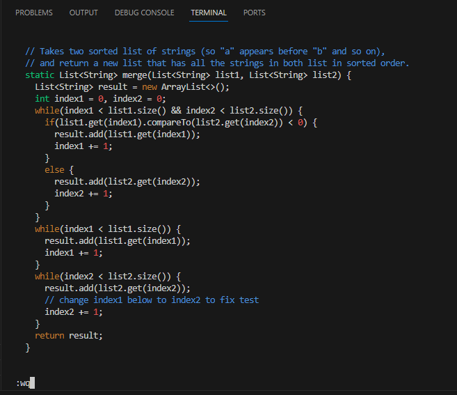
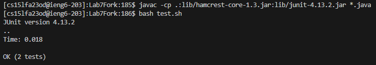
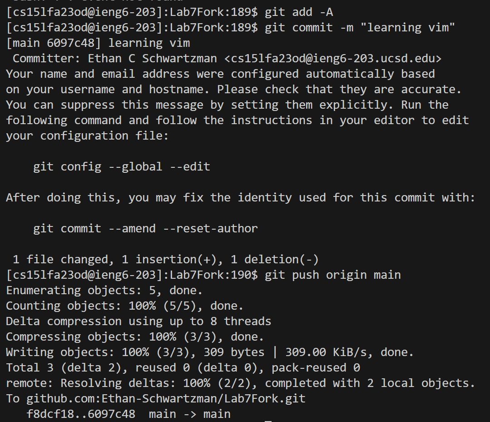

- #### Step 4 - Log into ieng6
	- Keys pressed: `ssh cs15lfa23od@ieng6.ucsd.edu<enter>`
	- This command connected me to a remote server (in the cse building basement). I did not need to enter a password because I previously did the ssh key setup.
	- 
- #### Step 5 - Cone your fork of the repository from your Github account (using the ssh url)
	- Keys pressed: `git clone <right click><enter>`
	- Before typing this command I copied the following text to my clipboard, `git@github.com:Ethan-Schwartzman/Lab7Fork.git`. By right clicking I pasted this text into the command line. This command cloned the repository and I did not need to sign in to my GitHub account because of the key (different from the key in step 4).
	- 
- #### Step 6 - Run the tests, demonstrating that they fail
	- Keys pressed: `cd Lab7Fork<enter>javac <right click> *.java<enter>bash test.sh<enter>`
	- Before typing this command I copied the following text to my clipboard, `-cp .:lib/hamcrest-core-1.3.jar:lib/junit-4.13.2.jar`. By right clicking, I pasted this text into the command line. The cd at the beginning was to move into the directory of the repository I just cloned. This has the effect of making later commands easier by having a shorter relative path to the files. The tests were run using the test bash script, test.sh.
	- 
- #### Step 7 - Edit the code file to fix the failing test
	- Keys pressed: `vim ListExamples.java<enter>43j11lxi2<esc>:wq<enter>`
	- First I opened the java file in vim using `vim ListExamples.java`. Then I typed `43j` to move down 43 lines and `11l` to move right 11 characters. I pressed `x` to delete the `1` from `index1` and then pressed `i2` to enter insert mode and add `2` to `index` to get `index2`. Finally I pressed `<esc>` to return to normal mode and `:wq<enter>` to save and quit.
	- 
- #### Step 8 - Run the tests, demonstrating that they now succeed
	- Keys pressed: `<up><up><up><enter><up><up><up><enter>`
	- I pressed `<up>` three times to go through my command history and pull up the last time I ran the `javac` command. Then I ran it again to compile the new changes. I did the same to access and run the bash script that runs the tests.
	- 
- #### Step 9 - Commit and push the resulting change to your Github account (you can pick any commit message!)
	- Keys pressed: `git add -A<enter>git commit -m "learning vim"<enter>git push origin main`
	- First I added my change with `git add` and I used `-A` to add all changes, which was only one thing in this case, but I added all because its easiest to type. Then I committed the change with `git commit` and I used `-m` to set the commit message. Finally, I pushed the change using `git push` and the `origin main` signifies "from where" and "where to" the changes are going. 
	- 