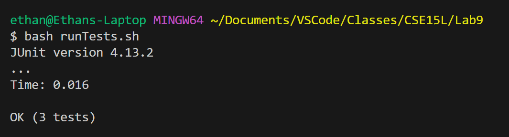

#### Student Post

I've been working on a file `Sorter.java` which sorts `String` data alphabetically from an input file. I wrote some test cases using JUnit but I have encountered a strange bug and cannot get them to pass.

Here is the terminal output after running `bash runTests.sh`, a bash script which compiles and runs all necessary java files and tests.


The symptom shown is that my code fails the test. The JUnit test shows that result of sorting the list should be `[1, 2, 3, 4, 5, 6]` but my buggy implementation resulted in `[3, 6, 1, 2, 4, 5]`.

I suspect that my bug lies somewhere in the `sort()` method which contains the logic for my sorting algorithm. I suspect this because the initial order of the list was `[5, 3, 1, 2, 4, 6]` which is different from the end result of `[3, 6, 1, 2, 4, 5]`. This means I am likely successfully swapping elements, but they are probably the wrong elements.

#### TA Response

A tool that might be useful here is the Java Debugger. I would suggest that you trace out how the sort method should behave on paper or in your notes and then compare it to what actually happens with the jdb. You can do this by setting breakpoints in your sorting algorithm and then checking the values of each variable in each pass.

#### Student follow-up

Thank you for the help! I was finally able to locate the bug. 

First I ran, `javac -g -cp ".;lib/hamcrest-core-1.3.jar;lib/junit-4.13.2.jar" *.java` to compile my code and generate debugging information by using the `-g` option. Then I ran my JUnit test with the jdb using `jdb -classpath ".;lib/hamcrest-core-1.3.jar;lib/junit-4.13.2.jar" org.junit.runner.JUnitCore SortTests`. Then I set a breakpoint on line 32.
```java
public void sort() {
    if(elements == null || elements.size() <= 1) return;
    for(int i = 0; i < elements.size()-1; i++) {
        for(int j = i+1; i < elements.size(); i++) {
            if(elements.get(i).compareTo(elements.get(j)) > 0) { // This is line 32!
                String temp = elements.get(i);
                elements.set(i, elements.get(j));
                elements.set(j, temp);
            }
        }
    }
}
```
I chose that line because it was inside both for loops, but not inside the if-statement so I could keep track of every iteration of the loop. I set the breakpoint with `stop at Sorter:32`. Then I ran the program using `run`. The debugger stopped at my breakpoint and I used `locals` to check the values of the local variables. I used `cont` to move to the next iteration and checked the local variables again.

That's when I noticed my bug. The inner loop, indexed with the variable `j` did not increment between passes of the loop. Instead, the outer loop was incrementing when it wasn't supposed to. I went back and double checked my code and I realized that on line 31 (the line before the breakpoint) I was accidentally incrementing `i` instead of `j`, meaning the inner loop would never increment and the outer loop would increment too fast.

#### Setup Information

The file structure of this example is as follows:
```
Lab9
|--input-files
|  |--empty-file.txt
|  |--sanity-test.txt
|  |--single-element.txt
|
|--lib
|  |--hamcrest-core.1.3.jar
|  |--junit-4.13.2.jar
|
|--runTests.sh
|--Sorter.java
|--SortTests.java
```

The contents of each file (before fixing the bug):
- input-files/empty-file.txt
```
```
- input-files/sanity-test.txt
```
5 3 1
2 4 6
```
- input-files/single-element.txt
```
3
```
- runTests.sh
```shell
javac -cp ".;lib/hamcrest-core-1.3.jar;lib/junit-4.13.2.jar" *.java
java -cp ".;lib/hamcrest-core-1.3.jar;lib/junit-4.13.2.jar" org.junit.runner.JUnitCore SortTests
```
- Sorter.java

```java

import java.io.File;
import java.util.Scanner;
import java.util.ArrayList;

public class Sorter {
    ArrayList<String> elements = new ArrayList<String>();
    
    public Sorter(String input) {
        try {
            File f = new File(input);
            Scanner fileReader = new Scanner(f);
            
            while (fileReader.hasNextLine()) {
                String[] data = fileReader.nextLine().split(" ");
                for(int i = 0; i < data.length; i++) {
                    elements.add(data[i]);
                }
            }
  
            fileReader.close();
        }
        catch(Exception e) {
            System.out.println("error reading file");
            e.printStackTrace();
        }
    }

    public void sort() {
        if(elements == null || elements.size() <= 1) return;
        for(int i = 0; i < elements.size()-1; i++) {
            for(int j = i+1; i < elements.size(); i++) {
                if(elements.get(i).compareTo(elements.get(j)) > 0) {
                    String temp = elements.get(i);
                    elements.set(i, elements.get(j));
                    elements.set(j, temp);
                }
            }
        }
    }
  
    public String toString() {
        String result = "";
        for(int i = 0; i < elements.size(); i++) {
            result += elements.get(i);
            if(i+1 < elements.size()) result += ", ";
        }
        return result;
    }
}
```

- SortTests.java

```java
import static org.junit.Assert.*;
import org.junit.*;

public class SortTests {

    @Test
    public void TestEmpty() {
        Sorter s = new Sorter("input-files/empty-file.txt");
        s.sort();
        assertEquals("", s.toString());
    }

    @Test
    public void SingleElementTest() {
        Sorter s = new Sorter("input-files/single-element.txt");
        s.sort();
        assertEquals("3", s.toString());
    }

    @Test
    public void SanityCheck() {
        Sorter s = new Sorter("input-files/sanity-test.txt");
        s.sort();
        assertEquals("1, 2, 3, 4, 5, 6", s.toString());
    }
}
```

To trigger the bug I ran
`bash runTests.sh`

The `runTests` script runs the junit tests in the `SortTests` class.

To fix the bug, replace the incorrect uses of `i` with `j` on line 31. This for loop (the inner loop) should be incrementing `j` and checking that `j` is within the bounds of `elements`.

Before:
```java
for(int j = i+1; i < elements.size(); i++) {
```

After:
```java
for(int j = i+1; j < elements.size(); j++) {
```

If `runTests.sh` is then run again, the output becomes the following:


#### Reflection

One thing I learned from my lab experience was how to manage shared code. For example, in many cases code was shared between multiple people and machines. I had to move code between my laptop and the ieng6 machines. I also learned to fork repositories and make git commits from the command line. This experience also led me to encounter some of the difficulties involved with collaborative code. In week 9 when we had to review other people's code, my code didn't work on the other person's machine because I had a Windows computer and the other person had a Mac. The other person then made a new branch on my github and sent over a fix. This was a new and interesting experience which is very valuable since work in the industry often involves passing code between many machines and people.
